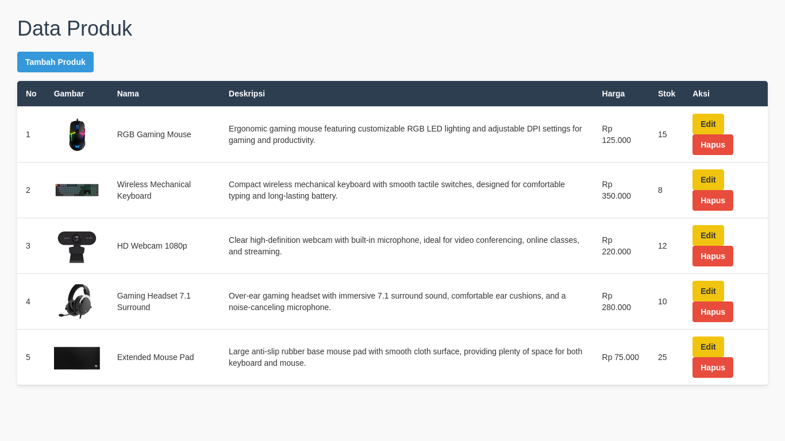

<p align="center"><a href="https://laravel.com" target="_blank"></a></p>

<p align="center">
<a href="https://github.com/laravel/framework/actions"></a>
<a href="https://packagist.org/packages/laravel/framework"></a>
<a href="https://packagist.org/packages/laravel/framework"></a>
<a href="https://packagist.org/packages/laravel/framework"></a>
</p>

<h1 align="center">Laravel CRUD</h1>

<p align="center">Aplikasi sederhana untuk mengelola data produk menggunakan Laravel.</p>

<p align="center">
  
</p>


## Fitur

- Menampilkan data produk
- Menambah produk
- Mengedit produk
- Menghapus produk

## Teknologi

- Laravel 13
- PHP
- MySQL

## Instalasi

Clone repository dan masuk ke folder project, kemudian jalankan:

```bash
composer install
cp .env.example .env
php artisan key:generate
php artisan migrate
php artisan serve
```

Buka aplikasi di browser:

http://127.0.0.1:8000

Halaman Produk
http://127.0.0.1:8000/produk
